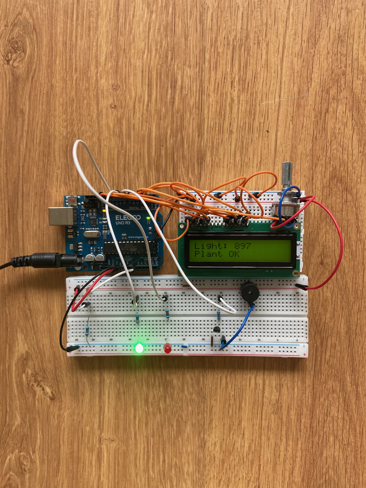

# 🌱 Smart Plant Monitor

Projet Arduino permettant de surveiller la luminosité d’une plante d’intérieur.

## 🎯 Objectif

Ce système mesure la lumière grâce à une photorésistance (LDR), affiche la valeur sur écran LCD et alerte si la plante manque de lumière.

## ⚙️ Fonctionnement

### Lumière suffisante

- LED verte allumée
- Message affiché :

Plant OK

### Lumière insuffisante

- LED rouge allumée
- Buzzer activé
- Message affiché :

Move Plant

## 📸 Aperçu du projet

## 🔌 Composants utilisés

- Arduino Uno
- écran LCD 16x2
- photorésistance (LDR)
- potentiomètre 10kΩ
- LED verte
- LED rouge
- buzzer
- transistor 2N2222
- résistances
- breadboard

## 🧠 Compétences mobilisées

- lecture analogique
- pont diviseur de tension
- affichage LCD
- pilotage LEDs
- transistor en commutation
- prototypage breadboard
- diagnostic de panne

## 💻 Code source

Le programme principal est disponible dans :

`src/smart_plant_monitor.ino`

## 🚀 Auteur

Projet personnel réalisé dans le cadre de mon apprentissage en électronique et systèmes embarqués.
