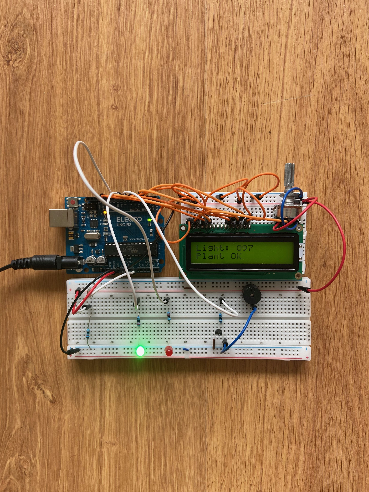
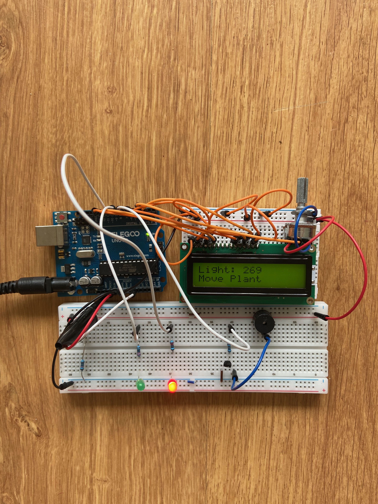

# 🌱 Smart Plant Monitor

Projet Arduino permettant de surveiller la luminosité d’une plante d’intérieur.

## 🎯 Objectif

Ce système mesure la lumière grâce à une photorésistance (LDR), affiche la valeur sur écran LCD et alerte si la plante manque de lumière.

## ⚙️ Fonctionnement

### Lumière suffisante

- LED verte allumée
- message affiché :

Plant OK

### Lumière insuffisante

- LED rouge allumée
- buzzer activé
- message affiché :

Move Plant

---

## 📸 Aperçu du projet

### Montage principal

### Lumière correcte

### Alerte manque de lumière

---

## 🎥 Démonstration vidéo

[▶ Voir la vidéo du projet](videos/demo.mp4)

---

## 🔌 Composants utilisés

- Arduino Uno
- écran LCD 16x2
- photorésistance (LDR)
- potentiomètre 10kΩ
- LED verte
- LED rouge
- buzzer
- transistor 2N2222
- résistances
- breadboard

---

## 🧠 Compétences mobilisées

- lecture analogique
- pont diviseur de tension
- affichage LCD
- pilotage LEDs
- transistor en commutation
- prototypage breadboard
- diagnostic de panne
- programmation Arduino C++

---

## 💻 Code source

Le programme principal est disponible dans :

`smart_plant_monitor.ino`

---

## 🚀 Auteur

Projet personnel réalisé dans le cadre de ma préparation à un BTS CIEL (option électronique & réseaux) et de ma recherche d’alternance.
